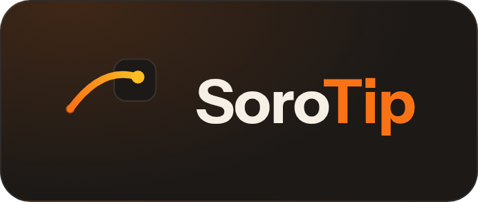

<p align="center">
  
</p>

# @sorotip/sdk

**TypeScript SDK for SoroTip — on-chain tipping and creator monetization on Stellar Soroban**

[](https://www.npmjs.com/package/@sorotip/sdk)
[](https://www.typescriptlang.org/)
[](./LICENSE)
[](https://drips.network/wave)
[](https://sorotip-app.vercel.app)

`@sorotip/sdk` wraps the [SoroTip](https://github.com/SoroTip/sorotip-contracts)
Soroban contract behind a typed client, a Freighter wallet adapter, formatting
utilities, and a set of React hooks — everything a frontend needs to register
creators, send tips, manage subscriptions, and read protocol data, without
touching raw Soroban RPC calls or ScVal conversion directly.

## Installation

```bash
npm install @sorotip/sdk
```

`react` is an optional peer dependency — only needed if you use the hooks in
`@sorotip/sdk` (import from the package root as usual; everything else works
in any TypeScript/JavaScript environment).

## Quick Start

```ts
import { SoroTipClient, connectWallet } from "@sorotip/sdk";

const client = new SoroTipClient({
  network: "testnet",
  contractId: "CA...", // your deployed SoroTip contract id
});

// Connect the user's Freighter wallet (prompts if not already authorized)
const publicKey = await connectWallet();

// Register as a creator
const { profileId, txHash } = await client.registerCreator({
  name: "Ada",
  bio: "Building on Stellar",
  avatarIpfs: "Qm...",
});

// Send a tip (amount is a decimal USDC string)
await client.tip({
  to: "GDESTINATIONADDRESS...",
  amount: "5",
  messageIpfs: "",
});

// Open a $3/month subscription
await client.subscribe({ to: "GDESTINATIONADDRESS...", amountPerMonth: "3" });

// Read a creator's public profile — no wallet connection needed
const profile = await client.getProfile("GDESTINATIONADDRESS...");
```

## React Hooks

```tsx
import { SoroTipClient, useProfile, useTipHistory, useTopCreators } from "@sorotip/sdk";

const client = new SoroTipClient({ network: "testnet", contractId: "CA..." });

function CreatorPage({ wallet }: { wallet: string }) {
  const { profile, isLoading, refetch } = useProfile(client, wallet);
  const { tips } = useTipHistory(client, wallet, 10);

  if (isLoading) return <p>Loading...</p>;
  return (
    <div>
      <h1>{profile?.name}</h1>
      <button onClick={refetch}>Refresh</button>
      <ul>{tips?.map((t) => <li key={t.id}>{t.amount}</li>)}</ul>
    </div>
  );
}

function Leaderboard() {
  const { creators } = useTopCreators(client, 6);
  return <ul>{creators?.map((c) => <li key={c.wallet}>{c.name}</li>)}</ul>;
}
```

Every data-fetching hook takes the `SoroTipClient` instance as its first
argument, so a single client (and its RPC connection) can be shared across a
whole app.

## API Reference

| Export | Description |
|---|---|
| `SoroTipClient` | Main client class — construct once with `{ network, contractId }`. |
| `connectWallet()` | Prompts the user to connect Freighter, returns their public key. |
| `getPublicKey()` | Returns the already-connected wallet's public key. |
| `isConnected()` | Whether this site has permission to access the wallet. |
| `isFreighterInstalled()` | Whether the Freighter extension is present. |
| `signTransaction(xdr, opts?)` | Signs a transaction XDR via Freighter. |
| `formatUSDC`, `toStroops` | Convert between raw stroops and decimal USDC strings. |
| `truncateAddress`, `timeAgo`, `formatTipAmount`, `formatSubscriptionAmount`, `goalProgressPercent` | Display formatting helpers. |
| `useProfile`, `useTipHistory`, `useSubscriptions`, `useTipGoal`, `useTopCreators`, `useProtocolStats`, `useWallet` | React hooks. |

See the inline JSDoc on each export for full parameter and return details.

## Contributing via Drips Wave

This repo is part of the [Stellar Wave Program](https://drips.network/wave)
on Drips. Contributors browse open issues, get assigned by the maintainer,
and earn USDC rewards for merged pull requests that resolve an issue. See
[CONTRIBUTING.md](./CONTRIBUTING.md) for the full workflow.

👉 https://drips.network/wave
